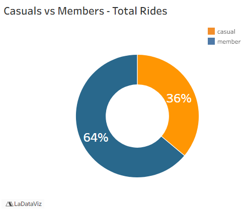

# Casual Riders vs. Annual Members Analysis for Cyclistic

## Executive Summary:
I used SQL to combine 12 months of Cyclistic data from 2024 into a single master dataset. After cleaning and analyzing the data in SQL, I exported the results to Excel and converted them into a CSV file compatible with Tableau Public. I then created data visualizations in both Tableau and Excel to explore key trends and insights. Based on the analysis, I prepared a presentation and final report recommending strategies such as:
1. Weekend and tourist-focused membership offers for casual riders
2. Partnering with local attractions in hot-spot areas to offer discounts to members
3. Using app notifications and email campaigns to encourage frequent casual riders to convert to annual members

### Business Task:
The marketing director believes that expanding the base of annual members is essential for Cyclistic's future growth.
Our goal is to increase membership sales by converting casual riders into annual members.

### Methodology:
1. Combined 12 months of Cyclistic 2024 trip data into a single master dataset using SQL.
2. Cleaned and transformed the data in SQL to ensure consistency across all months.
3. Analyzed rider trends in SQL and built Tableau and Excel dashboards to compare casual and annual members.
4. Created a presentation summarizing key insights and recommendations to convert casual riders into members.

### Skills:
  SQL: Case, joins, and aggregate functions  
  Excel: Pivot tables, visualizations, and trend analysis  
  Tableau: Dashboard creation and data visualizations  
  Presentation: Designing easy-to-understand presentations that highlight key insights  

### Results & Business Recommendation:

- [Kaggle Datasets](https://www.kaggle.com/datasets)
- [UCI Machine Learning Repository](https://archive.ics.uci.edu/ml/index.php)
- [Public APIs]

---

## 📬 Contact

- **Email:** your.email@example.com
- **LinkedIn:** [Your LinkedIn](https://linkedin.com/in/yourprofile)

---

## 🚀 How to Use

Clone the repo and run the Jupyter notebooks in the `notebooks/` directory, or explore the dashboards linked above.
